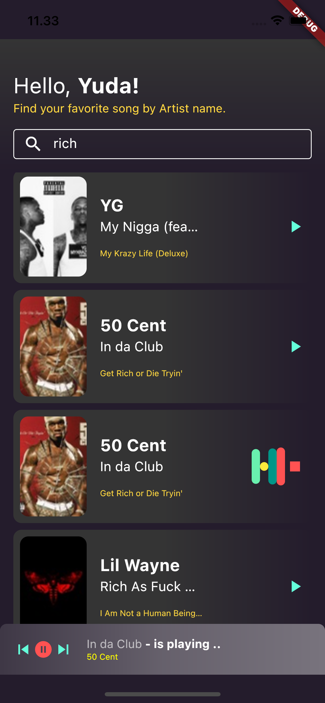
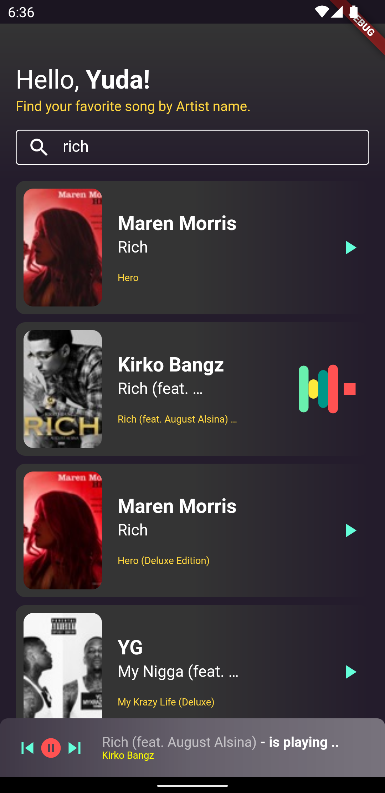

# oni_music_player

- Architecture
    - Project structure
    - Presentation
    - Domain
    - Data
- Testing
    - Kind of test
    - Test structure
- 3rd party library
- How to run the project
- Features
- Screenshot
    - IOS
    - Android
- Installing apk

## Architecture

### Project Structure
```
Main
|--- Presentation
|   |- Feature-x
|     |- Route
|     |- page
|     |- etc
|
|--- Domain
|   |- Feature-x
|
|--- Data
|   |- Feature-x
```

This is the framework how the project structure is for oni music player project. As you can see here, i tried to seperate some modules into 3 layers:

1. Presentation
2. Domain
3. Data

Let's iterate the layer one by one, start from the presentation layer first.

### Presentation Layer

So what kind of file should be here? anything about user interface things like screen, component, and presenter to named a few. There are several rules on the presentation layer

 - Presentation layer not allowed to depends on data layer directly. We can depend on the domain layer instead.
 - Avoid to depends on class implementation, instead we have to depends on the abstraction.

Let's going deeper on how the main structure & architecture in the presentation layer.

A. Routing

For each feature should have their own router. Create router package, then you have to write a simple `class` and `extends OniRouter`. So for example i want to add new feature (feature_auth) in the module, then what i have to do is create the router package, then create `AuthRouter`.

```dart
class AuthRouter extends OniRouter {
  @override
  Map<String, WidgetBuilder> get routes => {
    '/auth': (context) => const AuthPage(),
  };
}
```

As simple as the code above, you have to override the routes then define all routes there. When you have done, before you can navigate to the routes that you alredy define, you have to registering the `AuthRouter` class in `main.dart`.
```dart
routes: _populateRoutes([
    SearchRouter(),
    AuthRouter(),
]),
```
And now, you can navigate to new route that just created by calling
```dart
Router.pushNamed(context, '/auth');
```
Simple right? now we can moving on to the next part, presenter.

B. Presenter

Don't get caught up with the `presenter` word. It's perhaps looks like dejavu with the `MVP` architecture, but this is actually a bit different thing. So let's find out.

On this architecture, i tried to create `presenter` using reactive programming paradigm. So if you think that it's tight coupled with the view like the `presenter` in the `MVP` architecture then you are completely wrong.
```dart
abstract class OniPresenter<S, E> {
  final ValueNotifier<S> state;

  OniPresenter(this.state);

  void emit(E event) {
    mapEvent(event);
  }

  void mapEvent(E event);

  void dispose() {
    state.dispose();
  }
}

```
First, you can see the code above, the abstraction of presenter. The generic type `S` is for `state`, and `E` is for `event`. The concept is looks like the `Bloc` architecture, because not going to lie that i am the admire of this architecture. But on this case, i want to create my own architecture for state management without any 3rd party library, so that's why i create this.

So what is event? and why i need this in presenter? Event is basically an action that could happend in the screen and depends on what kind of action that triggered by user. For example, user click play button, that is event right? and also search some song. So all of these event should be emitted from screen to the presenter and the presenter job is mapping the event become an action that should be done on the presenter and the final result is to change the state to updating the ui.

How the presenter can update the UI? as you can see on the `OniPresenter` our state using  `ValueNotifier`, so everytime we set new `state` the widget listener would be rebuild. But as you know that for each `ValueNotifier` should be `dispose` when it's not being used anymore so you have to call `presenter.dispose()` on the page to make sure the `state` is `disposed` as well. Oke let's move to the next part, Page.

C. Page

Nothing special here, as simple as create a statefull widget then you have to depends on the `presenter` and also use `ValueListenableBuilder` for the widget that need to rebuild everytime the `state` is changed. And also please refer to the rules that i previously mention about we have to depends on the abstraction instead of the class implementation. For any kind of api that need to call network like repository and music player you have to make it as a page properties that can be passed outside the screen, so we can pass fake implementation for test reason.

### Domain Layer

Domain layer contains any business logic, and also some interfaces for the data. So our presentation layer should not depends on the data layer directly, but instead depends on the domain layer.

For this project the domain layer only contain a simple things like entity and also an abstraction of repository and media player. At the moment i don't think that we need to create a use case since it's a quite simple and just need to use only single API, so i decided to use  repository directly on the presentation layer.

### Data Layer

Data layer contains any kind of data sources and also for 3rd party library on this case i am using `audioPlayer` library. So, perhaps you are confusing why we need to create an abstraction for third party library in the domain then we create the implementation class in the data layer? why we don't directly use the third party library on the `presentation` layer instead? Yea, if we're talking about the simplycity and the fastest way to implement it in our project then that is a good approach to use directly on the presentation layer. But the point is what if happen if we have to change the third party library to the another library for any reason? or the current version of library is deprecated and we have to force update and a lot of api has been changed? you will going to be crazy to fix here and there when you're using it in a lot of screen in the presentation layer. But when we have an abstraction, our own api that consumed by screen is still the same with the previouse one, only the class implementation that need to be changed or refactor right? so we don't need to refactor anything in the presentation layer. That the same thing for the model in data layer. Why i need to create a model when i already have an entity in the domain layer? just because when someday if i need to change the way i parse json in data layer perhaps i use library or even i need to use another type of data for example `xml`, my data that is consumed by screen in the presentation layer not going to be changed because the presentation layer depend on the entity in the domain layer. I just need to modify the model inside the data layer right? but the entity is still the same.

Also for the network layer, i've been created my own library that is build with `dio` lib for the network request. I seperate the lib in the library module, so when i need to create a new project one day i just need to import that library into the project.

## Testing

### Kind of tests
In flutter we have 3 kind of tests
1. Unit test
2. Widget test
3. Integration test

But in this project, i just implement 2 of these kind of tests. The first one is unit test, for the `presenter`, and the next one is widget test for the `screen`. Let's going a bit deeper on this.

1. Unit test

    Basically unit test is just a simple test for the presenter. As the name, it's just a unit of test. Test what logic do you have in the presenter, that's it.

2. Widget test

    For a widget test it's a bit different case. When you have a screen in flutter, then all of component in the screen is a widget right? so on this test you have to make sure that all of widgets inside the screen are rendered properly based on the state of the screen. Basically there is no different between widget test and integration test, the code is completly same there is no different there, the different is just based on complexity. For widget test is more simple than integration test, you just handle 1 screen without navigation flow then assert all of the widget based on the state that you have on the screen. But for integration test, it's more complex and with wider coverage because you have cover all of navigation things and it should be start from the beginning, open the app and do all of test cases. And the another different things is for the widget test we don't have to open emulator/simulator but for the integration test you have to.

### Test Structure
```
test
|---base
|   |-fake-data
|
|---unit-test
|   |-feature-x
|
|---widget-test
|   |-feature-x
```
So on this project i separate the test into some package
1. Base

    Base should be contain any kind of fake data that would be used by some feature.

2. Unit test

    As the name unit test contain all of unit test that coming from all of features. So to make it easier to maintain, you have to split the package using `feature_x`. So if the project going bigger then it's still being maintanable.

3. Widget test

    As the name widget test contain all of widget test like `screen` or `component` that coming from all of features. The same thing with the unit test, you have to grouping the test in new package `feature_x`.

Some rules/tips:

1. Highly recommended to use `When, Given, Then` as the description in the test. That would be great for you and your Test Engineer to read the test easyly.
2. For widget test, when the screen or component using `Image.network` then you have to wrap the widget with `HttpOverrides.runWithHttpOverrides` then override the `http` with `FakeHttpOverrides`. I already created fake http override in the `fake_data` package so you can use it directly in the test. You have to do this thing because when you pump the screen or component in test environment and your widget contain http request, the http request api would be directly returning 400 so that will cause your test broken. But when you override the http client with `FakeHttpOverrides` that would return 200, and when you have to use `Image.network` in the screen then you will get a fake image so that not cause an exception in your test.

## 3rd party library

On this project, i depends on some third party library

1. Dio (for networking purpose). [link](https://pub.dev/packages/dio)

    Why i choose dio, because this is support for interceptor. Just in case any api request need authorization, so i just need to create an interceptor then put it on the client.
2. Audioplayers (for audio streaming purpose). [link](https://pub.dev/packages/audioplayers)

    Why i choose this one, because it's looks simple enough to use and also the popularity of the library it self is great. This is the first time i used audio library.

## How to run the project

Basically it's quite simple, you have to preparing your emulator in android studio.

     Tools > AVD Manager > Click launch button

If you don't have any emulator installed on the AVD Manager, then you have to download it first. Then you can follow the step above afterward. After the emulator was running, then you can run the project directly by clicking Run icon on the android studio and make sure that you run `main.dart`.

Minimum Requirement for android device:

1. Lolipop (SDK 21)

Minimum Requirement for the project:

1. Flutter 2.10.1
2. Dart 2.16.1

## Features
1. Search song by artist name
2. Play song with some animation on the list item as an indicator
3. Pause the song using bottom music controller
4. Resume the song using bottom music controller
5. Skip to the previous song using bottom music controller
6. Skip to the next song using bottom music controller
7. Search another song with current song still playing

Notes:
By default, when you open the search screen it's just an empty state. You have to search the song first by using artist name then the result would be displayed.

## IOS



## Android



## Installing APK
if you want to get the apk directly and install it into your device, you can check in the `sample_asset` folder, then you will find the app-debug.apk